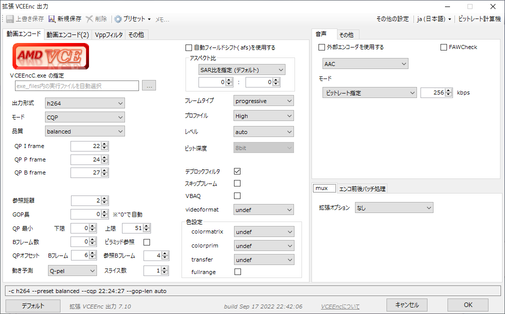

# VCEEnc  
by rigaya

    

このソフトウェアは、AMDのGPU/APUに搭載されているHWエンコーダ(VCE/VCN)の画質や速度といった性能の実験を目的としています。  
Aviutlの出力プラグイン版と単体で動作するコマンドライン版があります。  

- VCEEncC.exe  
  単体で動作するコマンドライン版です。本項で説明します。

- [VCEEnc.auo](./VCEEnc_auo_readme.md)  
  AMDのVCE/VCNを使用してエンコードを行う[Aviutl](http://spring-fragrance.mints.ne.jp/aviutl/)の出力プラグインについては、[こちら](./VCEEnc_auo_readme.md)を参照してください。

## 配布場所 & 更新履歴
[こちら](https://github.com/rigaya/VCEEnc/releases)  

## VCEEnc 使用にあたっての注意事項
無保証です。自己責任で使用してください。  
VCEEncを使用したことによる、いかなる損害・トラブルについても責任を負いません。

## インストール
インストール方法は[こちら](./Install.ja.md)。

## ビルド
ビルド方法は[こちら](./Build.ja.md)。

## 想定動作環境

### Windows
Windows 10/11 (x86/x64)  
Aviutl 1.00 以降 (VCEEnc.auo)  
VCEが載ったハードウェア  
  AMD製 GPU Radeon HD 7xxx以降  
  AMD製 APU Trinity世代(第2世代)以降  
  
### Linux
Debian/Ubuntu系 (VCEEncC)  
  そのほかのディストリビューションでも動作する可能性があります。

| VCEEnc | 必要なグラフィックスドライバのバージョン |
|:---|:---|
| VCEEnc 3.00以降 | AMD ドライバ 17.1.1 (16.50.2611) 以降 |
| VCEEnc 5.00以降 | AMD ドライバ 19.7.1 以降 |
| VCEEnc 5.01以降 | AMD ドライバ 19.12.1 以降 |
| VCEEnc 5.02以降 | AMD ドライバ 20.2.1 以降 |
| VCEEnc 6.09以降 | AMD ドライバ 20.11.2 以降 |
| VCEEnc 6.13以降 | AMD ドライバ 21.6.1 以降 |
| VCEEnc 6.17以降 | AMD ドライバ 21.12.1 以降 |
| VCEEnc 7.00以降 | AMD ドライバ 22.3.1 以降 |
| VCEEnc 7.03以降 | AMD ドライバ 22.7.1 以降 |
| VCEEnc 7.15以降 | AMD ドライバ 22.12.1 以降 |
| VCEEnc 8.07以降 | AMD ドライバ 23.1.2 以降 |
| VCEEnc 8.17以降 | AMD ドライバ 23.5.2 以降 |
| VCEEnc 8.23以降 | AMD ドライバ 24.6.1 以降 |

## VCEEncCの使用方法とオプション  
[VCEEncCのオプションの説明](./VCEEncC_Options.ja.md)

## 使用出来る主な機能
#### VCEEnc/VCEEncC共通
- VCEを使用したエンコード
   - H.264/AVC
   - HEVC (Polaris以降)
   - AV1
- VCEEncの各エンコードモード
   - CQP       固定量子化量
   - CBR       固定ビットレート
   - VBR       可変ビットレート
- Level / Profileの指定
- 最大ビットレートの指定
- 最大GOP長の指定
- SAR比の設定
- colormatrix等の指定
- 参照距離の設定
- Bフレーム数の設定

#### VCEEnc.auo (Aviutlプラグイン)
- 音声エンコード
- 音声及びチャプターとのmux機能
- 自動フィールドシフト対応

#### VCEEncC
- avs, vpy, y4m, rawなど各種形式に対応
- HWデコード
  - H.264
  - HEVC
  - MPEG2
  - VP9
  - VC-1
- HWリサイズ
- ソースファイルからの音声抽出や音声エンコード
- mp4,mkv,tsなどの多彩なコンテナに映像・音声をmuxしながら出力
- エンコード結果のSSIM/PSNRを計算
- GPUを使用した高速フィルタリング
  - OpenCLによるGPUフィルタリング
    - インタレ解除  
      - afs (自動フィールドシフト)
      - nnedi
    - 字幕焼きこみ
    - 色空間変換
      - hdr2sdr
    - リサイズ  
      - spline16, spline36, spline64
      - lanczos2, lanczos3, lanczos4
    - 回転 / 反転
    - パディング(黒帯)の追加
    - バンディング低減
    - ノイズ除去
      - knn (K-nearest neighbor)
      - pmd (正則化pmd法)
    - 輪郭・ディテール強調
      - unsharp
      - edgelevel (エッジレベル調整)
      - warpsharp

## サポートされるHWエンコード

| GPU Arch | GPU Gen          | dGPU     | iGPU | VCE/VCN Gen | H.264 | HEVC | AV1 | 
|:--   |:--                   |:--       |:--   |:--:         |:--:   |:--   |:--  |
| GCN  | Southern/Sea Islands | HD7xxx, RX2xx | | VCE1, VCE2  | 8bit  |       |    |
|      | Volcanic Islands     | RX3xx         | | VCE3        | 8bit  |       |    |
|      | Polaris       | RX4xx, RX5xx  |        | VCE3.4      | 8bit  |  8bit |    |
|      | Vega          | Vega          |        | VCE4        | 8bit  |  8bit |    |
|      | Vega          |  | RyzenAPU(2xxx-3xxx) | VCN1        | 8bit  |  8bit |    |
|      | Vega          |  | RyzenAPU(4xxx-5xxx) | VCN2        | 8bit  | 10bit |    |
| RDNA | RDNA1         | RX5xxx      |          | VCN2        | 8bit  | 10bit |    |
|      | RDNA2         | RX6xxx*     | Zen4 APU | VCN3        | 8bit  | 10bit |    |
|      | RDNA3         | RX7xxx      |          | VCN4        | 8bit  | 10bit | 10bit |

* RX6400とRX6500XTは非対応です。

## マルチGPU環境でのGPU自動選択
VCEEncCでは、VCE/VCNを実行可能なGPUが複数存在する場合、
指定されたオプションをもとに実行時に最適なGPUを自動選択します。
自動選択に任せず、自分でGPUを選択する場合には--deviceオプションで指定してください。

1. 指定オプションを実行可能なGPUを選択  
  指定されたオプションから下記をチェックします。  
  - 指定されたコーデック、プロファイル、レベルのサポート
  - 下記を指定した場合、それをサポートしているかチェック
    - 10ビット深度
    - HWデコードのサポート (avhw指定時)
  
2. 指定オプションを満たすGPUを優先  
  下記条件のチェックし、実行可能なGPUを優先します。  
  - Bフレームの使用が指定された場合、Bフレームのサポート
  - --paが指定された場合、pre-analysisのサポート
  
3. 1と2の条件を満たすGPUが複数ある場合、下記条件をチェックしてGPUを自動選択します。  
  - Video Engine(VE)使用率の低いもの
  - GPU使用率の低いもの
  
  VE/GPU使用率の低いGPUで実行することで、複数のGPUを効率的に使用し、エンコード速度の最大限引き出します。
  
  なお、VE/GPU使用率の取得はエンコードの開始時に行われ、その値には数秒のタイムラグがあるため、
  エンコードをほぼ同時に複数開始すると、複数のエンコードが同じGPUに割り当てられてしまうことが
  多いのでご注意ください。

## ソースコードについて
- MITライセンスです。
- 本ソフトウェアは[AMD Media Framework](https://github.com/GPUOpen-LibrariesAndSDKs/AMF)のサンプルコードをベースに作成されており、
  AMD Media Frameworkのソースを含みます。
  詳細は各ソースのヘッダ部分や、VCEEnc_license.txtをご覧ください。
- 本ソフトウェアでは、
  [ffmpeg](https://ffmpeg.org/),
  [libplacebo](https://code.videolan.org/videolan/libplacebo),
  [libhdr10plus](https://github.com/quietvoid/hdr10plus_tool),
  [libdovi](https://github.com/quietvoid/dovi_tool),
  [tinyxml2](http://www.grinninglizard.com/tinyxml2/),
  [dtl](https://github.com/cubicdaiya/dtl),
  [clRNG](https://github.com/clMathLibraries/clRNG),
  [ttmath](http://www.ttmath.org/),
  [Caption2Ass](https://github.com/maki-rxrz/Caption2Ass_PCR)を使用しています。  
  これらのライセンスにつきましては、該当ソースのヘッダ部分や、VCEEnc_license.txtをご覧ください。

### ソース概要
Windows ... VCビルド  

文字コード: UTF-8-BOM  
改行: CRLF  
インデント: 半角空白x4
